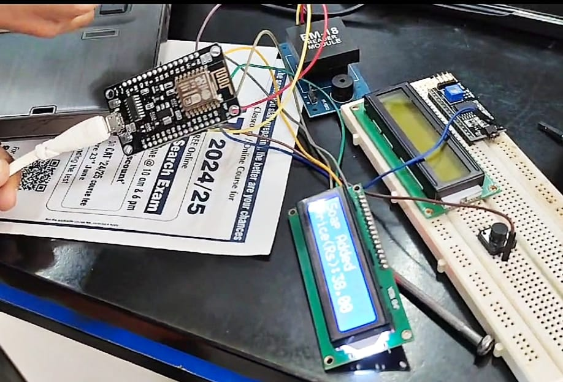
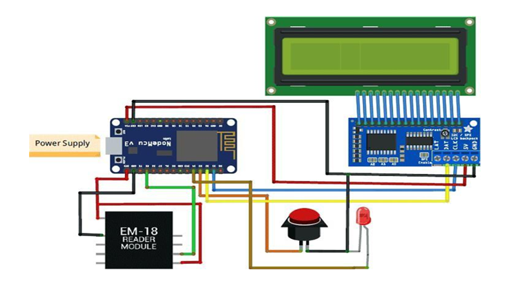
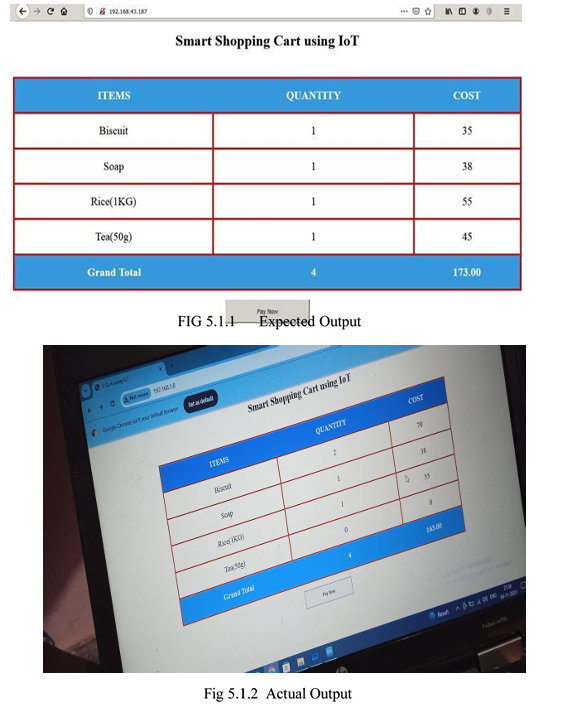

# 🛒 IoT Smart Shopping Cart with Automatic Billing

An IoT-based embedded system developed using **NodeMCU (ESP8266)** and **RFID technology** to simplify the shopping and billing process. The system automatically detects RFID-tagged products, updates the running bill, displays item details on an LCD, and hosts a simple web interface over a local Wi-Fi network.

> **Note:** This repository documents my B.Tech mini project. The source code is not included, but this repository explains the project design, hardware setup, workflow, and implementation.

---

# 📌 Project Overview

The main goal of this project was to reduce the time required for billing in retail stores.

Instead of scanning every product manually at the billing counter, RFID technology is used to identify products automatically. A NodeMCU (ESP8266) processes the RFID data, updates the bill, displays the product details on an LCD, and provides a simple web page to view the shopping cart information over a local Wi-Fi network.

This project demonstrates the integration of embedded systems, IoT, and RFID technology to build a working prototype.

---

# ✨ Features

- RFID-based product identification
- Automatic bill calculation
- Real-time LCD display
- Local web interface using NodeMCU
- Wi-Fi communication
- Item removal using a push button
- Audio and visual feedback using buzzer and LED

---

# 🛠 Hardware Components

- NodeMCU (ESP8266)
- EM-18 RFID Reader
- RFID Tags
- 16×2 LCD Display
- I2C LCD Module
- Push Button
- Buzzer
- LED
- Breadboard
- Jumper Wires

---

# 💻 Software Used

- Arduino IDE
- Embedded C / Arduino Programming
- HTML (Embedded Web Interface)

---

# ⚙️ System Workflow

1. The RFID reader scans the product tag.
2. The NodeMCU receives the RFID data.
3. Product details are identified.
4. The running bill is updated.
5. The LCD displays the current cart information.
6. The local web page is updated over Wi-Fi.
7. The customer can view the final bill without manually scanning products again.

For a detailed explanation, see:

- 📖 [Project Overview](docs/Project_Overview.md)
- ⚙️ [System Workflow](docs/System_Workflow.md)

---

# 📷 Project Images

### Hardware Setup

The prototype was built using a NodeMCU (ESP8266), EM-18 RFID reader, 16×2 LCD display, and supporting components on a breadboard.

---

### Circuit Diagram

The circuit diagram shows the hardware connections between the NodeMCU, RFID reader, LCD module, buzzer, push button, and other peripherals used in the project.

---

### Project Output

The output demonstrates the system displaying product information and updating the bill after an RFID-tagged item is scanned.

---

# 📂 Repository Structure

IoT-Smart-Shopping-Cart/
│
├── README.md
│
└── docs/
    ├── Project_Overview.md
    ├── System_Workflow.md
    └── images/

---

# 👨‍💻 My Role

This project was developed as a team of three members as part of our B.Tech mini project.

My contributions included:

- Contributing to the hardware integration and circuit assembly
- Working on the NodeMCU (ESP8266) and RFID module integration
- Participating in testing and debugging
- Assisting in preparing the project documentation
- Leading the final project demonstration and technical presentation

---

# 📚 What I Learned

Through this project, I gained practical experience in:

- Embedded system development
- RFID technology
- IoT using NodeMCU (ESP8266)
- Hardware interfacing
- LCD communication
- Basic web server development
- Circuit debugging
- Team collaboration

---

# 🎓 Academic Project

This project was developed as part of my B.Tech in Electronics and Communication Engineering.

The repository focuses on documenting the project design, implementation approach, and overall learning experience.
